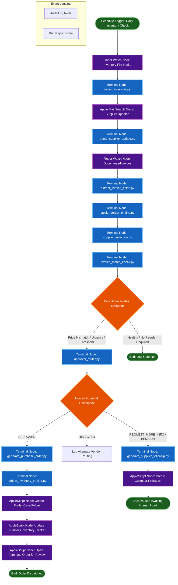

# Orcha Canvas Blueprint: OrchaInventoryOps

This document defines the visual canvas node configuration for the **OrchaInventoryOps** workflow. It details the input, output, routing logic, retry policy, and audit trail hooks for every node on the canvas.

This workflow uses representative business records so the architecture, routing logic, approval model, and Mac-native automation pattern can be reviewed without exposing protected client information.

## 1. Flowchart Canvas Overview

---

## 2. Orcha Node Definitions

### Node 01: Schedule Trigger: Daily Inventory Check
* **Node ID:** `NODE-TRG-001`
* **Node Type:** Schedule Trigger
* **Purpose:** Triggers the workflow execution daily at 07:00 AM local time.
* **Inputs:** None (Time-triggered)
* **Outputs:** `trigger_timestamp` (ISO String)
* **Success Route:** `NODE-FND-002` (Inventory File Intake)
* **Failure Route:** None (Retry on next cron cycle)
* **Retry Policy:** Standard schedule retry (3 attempts, 5-minute intervals)
* **Human Review:** None
* **Audit Event:** `TRIGGER_FIRED`

---

### Node 02: Finder Watch Node: Inventory File Intake
* **Node ID:** `NODE-FND-002`
* **Node Type:** Finder File Watcher
* **Purpose:** Monitors local directory `business_data/inventory/` for arrival/update of stock sheet.
* **Inputs:** `watch_directory_path`
* **Outputs:** `inventory_file_path`
* **Success Route:** `NODE-TRM-003` (ingest_inventory.py)
* **Failure Route:** Workflow Pause (Hold execution, alert administrator)
* **Retry Policy:** Poll folder every 10 seconds for up to 30 minutes
* **Human Review:** Alert ops team if inventory sheet is missing at trigger time
* **Audit Event:** `INVENTORY_FILE_DETECTED`

---

### Node 03: Terminal Node: ingest_inventory.py
* **Node ID:** `NODE-TRM-003`
* **Node Type:** Terminal Command Execution
* **Purpose:** Reads stock CSV records, parses limits, and normalizes fields.
* **Inputs:** `inventory_file_path`, `reorder_thresholds_file_path`
* **Outputs:** `inventory_dataset` (JSON format payload of SKUs)
* **Success Route:** `NODE-APP-004` (Apple Mail Supplier Search)
* **Failure Route:** Route to review (abort automated parsing if columns are malformed)
* **Retry Policy:** No retry (fail-fast on malformed CSV headers)
* **Human Review:** Triggered if mandatory headers are missing
* **Audit Event:** `INVENTORY_PARSED`

---

### Node 04: Apple Mail Search Node: Supplier Updates
* **Node ID:** `NODE-APP-004`
* **Node Type:** Native Application Hook (Apple Mail)
* **Purpose:** Searches local Apple Mail mailbox for messages matching supplier updates or availability confirmations.
* **Inputs:** `supplier_master_emails`, `search_keyword_filter`
* **Outputs:** `extracted_email_text_paths` (list of paths to local temp text dumps)
* **Success Route:** `NODE-TRM-005` (parse_supplier_update.py)
* **Failure Route:** Skip search and proceed with catalog defaults (log warning)
* **Retry Policy:** 2 retries, 1-minute backoff
* **Human Review:** None
* **Audit Event:** `MAILBOX_SEARCH_COMPLETED`

---

### Node 05: Terminal Node: parse_supplier_update.py
* **Node ID:** `NODE-TRM-005`
* **Node Type:** Terminal Command Execution
* **Purpose:** Extracts availability dates, revised lead times, and price changes from message logs.
* **Inputs:** `extracted_email_text_paths`
* **Outputs:** `supplier_updates_dataset` (JSON format keyed by Supplier ID)
* **Success Route:** `NODE-FND-006` (Documents Intake)
* **Failure Route:** Skip update parsing (default to master supplier records)
* **Retry Policy:** 1 retry
* **Human Review:** Triggered if price change exceeds 50%
* **Audit Event:** `SUPPLIER_UPDATES_PARSED`

---

### Node 06: Finder Watch Node: Documents/Invoices Intake
* **Node ID:** `NODE-FND-006`
* **Node Type:** Finder File Watcher
* **Purpose:** Monitors incoming invoice documents in `business_data/documents/`.
* **Inputs:** `documents_directory_path`
* **Outputs:** `invoice_document_paths`
* **Success Route:** `NODE-TRM-007` (extract_invoice_fields.py)
* **Failure Route:** Proceed with empty invoice matching queue
* **Retry Policy:** None
* **Human Review:** None
* **Audit Event:** `INVOICES_DETECTED`

---

### Node 07: Terminal Node: extract_invoice_fields.py
* **Node ID:** `NODE-TRM-007`
* **Node Type:** Terminal Command Execution (OCR Parser)
* **Purpose:** Extracts billing fields (SKU, quantities, total, date) from document text, applying error-correction.
* **Inputs:** `invoice_document_paths`
* **Outputs:** `extracted_invoices_dataset` (JSON format, confidence scores included)
* **Success Route:** `NODE-TRM-008` (stock_reorder_engine.py)
* **Failure Route:** `NODE-TRM-013` (approval_router.py) if OCR confidence is < 0.70 (Review Required)
* **Retry Policy:** 2 retries on character extraction script error
* **Human Review:** Force review if extraction confidence is below 0.70
* **Audit Event:** `INVOICE_FIELDS_EXTRACTED`

---

### Node 08: Terminal Node: stock_reorder_engine.py
* **Node ID:** `NODE-TRM-008`
* **Node Type:** Terminal Command Execution
* **Purpose:** Calculates stock days remaining and defines reorder quantity.
* **Inputs:** `inventory_dataset`
* **Outputs:** `reorder_recommendations` (JSON)
* **Success Route:** `NODE-TRM-009` (supplier_selection.py)
* **Failure Route:** Abort SKU processing, continue next SKU
* **Retry Policy:** 1 retry
* **Human Review:** None
* **Audit Event:** `REORDER_RECOMMENDATION_CALCULATED`

---

### Node 09: Terminal Node: supplier_selection.py
* **Node ID:** `NODE-TRM-009`
* **Node Type:** Terminal Command Execution
* **Purpose:** Runs vendor selection scoring model, selecting preferred or backup vendors.
* **Inputs:** `reorder_recommendations`, `supplier_updates_dataset`, `supplier_master_csv`
* **Outputs:** `supplier_selections_dataset` (JSON)
* **Success Route:** `NODE-TRM-010` (invoice_match_check.py)
* **Failure Route:** Raise stockout alert, pause pipeline
* **Retry Policy:** No retry
* **Human Review:** Triggered if zero suppliers support the SKU category
* **Audit Event:** `SUPPLIER_RECONCILIATION_FINISHED`

---

### Node 10: Terminal Node: invoice_match_check.py
* **Node ID:** `NODE-TRM-010`
* **Node Type:** Terminal Command Execution
* **Purpose:** Validates invoice totals and unit pricing against master stock details.
* **Inputs:** `extracted_invoices_dataset`, `supplier_selections_dataset`, `invoice_matching_rules_csv`
* **Outputs:** `matching_status_dataset` (JSON)
* **Success Route:** `NODE-CND-011` (Conditional Stock Evaluator)
* **Failure Route:** Route to review (mismatch detected)
* **Retry Policy:** None
* **Human Review:** Required if billing prices differ from contract sheets by > 2%
* **Audit Event:** `INVOICE_CHECK_COMPLETE`

---

### Node 11: Conditional Node: Evaluator
* **Node ID:** `NODE-CND-011`
* **Node Type:** Conditional Router
* **Purpose:** Route logic depending on stock health, invoice flags, price variances, and vendor risks.
* **Inputs:** `reorder_recommendations`, `matching_status_dataset`
* **Outputs:** Target routes
* **Routes:**
  - Route A (Healthy stock, no action): `NODE-END-012` (Log & Monitor)
  - Route B (Reorder needed, exceptions identified): `NODE-TRM-013` (approval_router.py)
  - Route C (Reorder needed, clean validation): `NODE-TRM-015` (generate_purchase_order.py)
* **Human Review:** None
* **Audit Event:** `ROUTING_DETERMINED`

---

### Node 12: End Node: Log & Monitor
* **Node ID:** `NODE-END-012`
* **Node Type:** Terminus
* **Purpose:** Concludes processing path for healthy stock.
* **Inputs:** None
* **Outputs:** Logged status
* **Audit Event:** `STOCK_HEALTHY_FINISHED`

---

### Node 13: Terminal Node: approval_router.py
* **Node ID:** `NODE-TRM-013`
* **Node Type:** Terminal Command Execution
* **Purpose:** Evaluates compliance limit thresholds and publishes markdown approval forms.
* **Inputs:** `supplier_selections_dataset`, `matching_status_dataset`, `reorder_recommendations`
* **Outputs:** `approval_status_summary` (JSON), `approval_request_file`
* **Success Route:** `NODE-HMN-014` (Human Approval Checkpoint)
* **Failure Route:** Raise system exception (permission issues writing forms)
* **Retry Policy:** 2 retries
* **Human Review:** Core approval gate router
* **Audit Event:** `APPROVAL_FORM_PUBLISHED`

---

### Node 14: Human Approval Node: Procurement Approval
* **Node ID:** `NODE-HMN-014`
* **Node Type:** Human-in-the-Loop Checkpoint
* **Purpose:** Pauses workflow to wait for local file-based decision signature.
* **Inputs:** `approval_request_file`, `approval_decision_file`
* **Outputs:** `approval_decision` (`APPROVE`, `REJECT`, `REQUEST_MORE_INFO`)
* **Routes:**
  - If `APPROVE`: `NODE-TRM-015` (generate_purchase_order.py)
  - If `REJECT`: `NODE-ALT-017` (Alternate Sourcing Route)
  - If `REQUEST_MORE_INFO` / `PENDING`: `NODE-TRM-018` (generate_supplier_followup.py)
* **Human Review:** Manual input required
* **Audit Event:** `HUMAN_DECISION_REGISTERED`

---

### Node 15: Terminal Node: generate_purchase_order.py
* **Node ID:** `NODE-TRM-015`
* **Node Type:** Terminal Command Execution
* **Purpose:** Generates a compiled markdown purchase order utilizing corporate templates.
* **Inputs:** `supplier_selections_dataset`, `reorder_recommendations`, `approval_decision`
* **Outputs:** `purchase_order_file_path`
* **Success Route:** `NODE-TRM-016` (update_inventory_tracker.py)
* **Failure Route:** Log order compilation error, alert admin
* **Retry Policy:** 3 retries
* **Human Review:** None
* **Audit Event:** `PURCHASE_ORDER_COMPILED`

---

### Node 16: Terminal Node: update_inventory_tracker.py
* **Node ID:** `NODE-TRM-016`
* **Node Type:** Terminal Command Execution (Database Update)
* **Purpose:** Performs idempotent register updates in the open purchase order ledger.
* **Inputs:** `purchase_order_file_path`, `tracker_file_path`
* **Outputs:** `updated_tracker_status`
* **Success Route:** `NODE-APP-019` (Create Finder Case Folder)
* **Failure Route:** Skip database write, alert admin of record block
* **Retry Policy:** 5 retries (exponential backoff for lock resolution)
* **Human Review:** Triggered if file is locked for over 2 minutes
* **Audit Event:** `OPEN_ORDER_TRACKER_UPDATED`

---

### Node 17: Terminal Node: generate_supplier_followup.py
* **Node ID:** `NODE-TRM-018`
* **Node Type:** Terminal Command Execution
* **Purpose:** Drafts follow-up emails for pricing variances, supply chain delays, or clarification events.
* **Inputs:** `supplier_selections_dataset`, `matching_status_dataset`, `decision`
* **Outputs:** `followup_draft_file_path`
* **Success Route:** `NODE-APP-022` (Create Calendar Supplier Follow-up)
* **Failure Route:** Log drafting error
* **Retry Policy:** 2 retries
* **Human Review:** None
* **Audit Event:** `FOLLOWUP_DRAFTED`

---

### Node 18: AppleScript Node: Create Finder Case Folder
* **Node ID:** `NODE-APP-019`
* **Node Type:** Native Application Hook (Finder)
* **Purpose:** Creates and focuses a Finder workspace case folder locally for the approved SKU/PO.
* **Inputs:** `sku`, `po_id`, `supplier_name`, `case_folder_parent`
* **Outputs:** `finder_folder_status`
* **Success Route:** `NODE-APP-020` (Update Numbers Tracker UI)
* **Failure Route:** Graceful warning log (skip visual directory highlight)
* **Retry Policy:** No retry
* **Human Review:** None
* **Audit Event:** `FINDER_WORKSPACE_COMPILED`

---

### Node 19: AppleScript Node: Update Numbers Inventory Tracker
* **Node ID:** `NODE-APP-020`
* **Node Type:** Native Application Hook (Numbers)
* **Purpose:** Launches Apple Numbers and displays the active inventory sheet.
* **Inputs:** `tracker_file_path`
* **Outputs:** None
* **Success Route:** `NODE-APP-021` (Open Purchase Order for Review)
* **Failure Route:** Graceful fallback warning
* **Retry Policy:** No retry
* **Human Review:** None
* **Audit Event:** `SPREADSHEET_UI_LAUNCHED`

---

### Node 20: AppleScript Node: Open Purchase Order for Review
* **Node ID:** `NODE-APP-021`
* **Node Type:** Native Application Hook (TextEdit / Viewer)
* **Purpose:** Opens the newly compiled markdown purchase order for visual inspection.
* **Inputs:** `purchase_order_file_path`
* **Outputs:** None
* **Success Route:** `NODE-END-023` (Order Dispatched Terminus)
* **Failure Route:** Graceful warning log
* **Retry Policy:** No retry
* **Human Review:** Visual review
* **Audit Event:** `PO_SHOWN_FOR_VERIFICATION`

---

### Node 21: AppleScript Node: Create Calendar Supplier Follow-up
* **Node ID:** `NODE-APP-022`
* **Node Type:** Native Application Hook (Calendar)
* **Purpose:** Creates a follow-up appointment entry on Apple Calendar for pending issues.
* **Inputs:** `supplier_name`, `followup_date`, `sku`
* **Outputs:** None
* **Success Route:** `NODE-END-024` (Awaiting Human Checkpoint Terminus)
* **Failure Route:** Graceful warning log
* **Retry Policy:** No retry
* **Human Review:** None
* **Audit Event:** `CALENDAR_EVENT_SCHEDULED`
