# Orcha Workflow Canvas Blueprint: OrchaSalesFlow

This document details the visual canvas layout and node execution properties of the **OrchaSalesFlow** workflow implementation.

---

## Orcha Canvas Visual Layout

```mermaid
graph TD
    node_schedule_trigger[Schedule Trigger: Weekday Sales Intake] --> node_finder_watch[Finder Watch: Lead Intake Folder]
    node_finder_watch --> node_mail_search[AppleScript: Lead Email Search]
    node_mail_search --> node_parse_email[Terminal: Parse Lead Email]
    node_parse_email --> node_check_budget_presence{Conditional: Missing Budget?}
    
    %% Missing Budget Fallback Branch
    node_check_budget_presence -- Yes --> node_clarification_path[Terminal: Compile Clarification Letter]
    node_clarification_path --> node_create_finder_folder[AppleScript: Create Finder Case Folder]
    node_create_finder_folder --> node_update_crm_numbers[AppleScript: Update Numbers CRM]
    
    %% Standard Branch
    node_check_budget_presence -- No --> node_ocr_quote[OCR: Quote Document Extraction]
    node_ocr_quote --> node_extract_quote_fields[Terminal: Extract Quote Fields]
    node_extract_quote_fields --> node_check_ocr_confidence{Conditional: Low Confidence?}
    node_check_ocr_confidence -- Yes --> node_ocr_retry_fallback[Fallback: Correct OCR typos]
    node_check_ocr_confidence -- No --> node_lead_scoring[Terminal: Lead Scoring Grader]
    node_ocr_retry_fallback --> node_lead_scoring
    
    node_lead_scoring --> node_pricing_check[Terminal: Pricing Exception Checker]
    node_pricing_check --> node_check_approval_required{Conditional: Pricing Exception?}
    
    %% Approval Branch
    node_check_approval_required -- Yes --> node_human_approval_checkpoint[Human Approval Checkpoint: Pricing Review]
    node_human_approval_checkpoint -- Approved --> node_generate_proposal[Terminal: Compile Sales Proposal]
    node_human_approval_checkpoint -- Rejected --> node_update_crm_disqualified[Terminal: CRM Closed Lost Update]
    node_human_approval_checkpoint -- Info Request --> node_clarification_path
    
    %% Normal Path Continuation
    node_check_approval_required -- No --> node_generate_proposal
    node_generate_proposal --> node_create_finder_folder
    node_update_crm_numbers --> node_create_calendar_followup[AppleScript: Create Calendar Followup]
    node_create_calendar_followup --> node_open_proposal[AppleScript: Open Proposal Review]
    node_open_proposal --> node_write_audit_log[Audit Log: Write Audit Log]
    node_update_crm_disqualified --> node_write_audit_log
    node_write_audit_log --> node_end[End Node]
    
    node_update_crm_numbers --> clarify_end[End Node]
```

---

## Node Canvas Specifications

### 1. Schedule Trigger Node
* **Node ID:** `node_schedule_trigger`
* **Node Name:** `Weekday Sales Intake`
* **Node Type:** `ScheduleTrigger`
* **Purpose:** Triggers the pipeline execution on a set schedule.
* **Inputs:** None
* **Outputs:** `trigger_timestamp` (datetime)
* **Success Route:** `node_finder_watch`
* **Failure Route:** None
* **Retry Policy:** None
* **Human Review Condition:** None
* **Audit Event Emitted:** `WORKFLOW_TRIGGERED`

### 2. Finder Watch Node
* **Node ID:** `node_finder_watch`
* **Node Name:** `Lead Intake Folder`
* **Node Type:** `FinderWatchNode`
* **Purpose:** Monitors the directory `business_data/inbox` for new `.txt` files representing sales leads.
* **Inputs:** `watch_directory_path` (string)
* **Outputs:** `new_lead_file_paths` (list of strings)
* **Success Route:** `node_mail_search`
* **Failure Route:** Abort execution, log system warning.
* **Retry Policy:** None
* **Human Review Condition:** None
* **Audit Event Emitted:** `FILES_DETECTED`

### 3. Apple Mail Search Node
* **Node ID:** `node_mail_search`
* **Node Name:** `Lead Email Search`
* **Node Type:** `AppleScriptNode`
* **Purpose:** Accesses Apple Mail to locate previous email threads from the sender's address.
* **Inputs:** `contact_email` (string)
* **Outputs:** `mail_thread_exists` (boolean), `related_message_ids` (list)
* **Success Route:** `node_parse_email`
* **Failure Route:** Log warning, proceed with assumption of no previous thread.
* **Retry Policy:** 2 retries (with 5-second backoff)
* **Human Review Condition:** None
* **Audit Event Emitted:** `MAIL_QUERY_COMPLETE`

### 4. Python Terminal Node: parse_email.py
* **Node ID:** `node_parse_email`
* **Node Name:** `Parse Lead Email`
* **Node Type:** `PythonTerminalNode`
* **Purpose:** Parses contact details and project requirements from the email body text.
* **Inputs:** `email_file_path` (string)
* **Outputs:** `email_data` (JSON struct)
* **Success Route:** `node_check_budget_presence`
* **Failure Route:** Route to manual exception logging.
* **Retry Policy:** None
* **Human Review Condition:** None
* **Audit Event Emitted:** `EMAIL_PARSED`

### 5. Conditional Node: Missing Budget
* **Node ID:** `node_check_budget_presence`
* **Node Name:** `Missing Budget Classifier`
* **Node Type:** `ConditionalNode`
* **Purpose:** Branches the workflow depending on whether the budget variable is present.
* **Inputs:** `email_data.budget`
* **Outputs:** `branch` (string: "true" or "false")
* **Success Route:**
  * True (Budget present): `node_ocr_quote`
  * False (Budget missing): `node_clarification_path`
* **Failure Route:** None
* **Retry Policy:** None
* **Human Review Condition:** None
* **Audit Event Emitted:** `BUDGET_ROUTING_DECIDED`

### 6. OCR / Vision Node
* **Node ID:** `node_ocr_quote`
* **Node Name:** `Quote Document Extraction`
* **Node Type:** `OcrVisionNode`
* **Purpose:** Extracts text contents from quote attachments.
* **Inputs:** `attachment_path` (string)
* **Outputs:** `raw_ocr_text` (string)
* **Success Route:** `node_extract_quote_fields`
* **Failure Route:** Route to OCR fallback correction.
* **Retry Policy:** 1 automatic retry using enhanced contrast settings.
* **Human Review Condition:** None
* **Audit Event Emitted:** `OCR_TEXT_EXTRACTED`

### 7. Python Terminal Node: extract_quote_fields.py
* **Node ID:** `node_extract_quote_fields`
* **Node Name:** `Extract Quote Fields`
* **Node Type:** `PythonTerminalNode`
* **Purpose:** Resolves OCR spelling substitutions and extracts numbers, discounts, and payment terms.
* **Inputs:** `raw_ocr_text` (string)
* **Outputs:** `quote_data` (JSON struct), `ocr_confidence` (double)
* **Success Route:** `node_check_ocr_confidence`
* **Failure Route:** `node_ocr_retry_fallback`
* **Retry Policy:** None
* **Human Review Condition:** None
* **Audit Event Emitted:** `QUOTE_FIELDS_PARSED`

### 8. Conditional Node: Low OCR Confidence
* **Node ID:** `node_check_ocr_confidence`
* **Node Name:** `OCR Confidence Classifier`
* **Node Type:** `ConditionalNode`
* **Purpose:** Evaluates extraction confidence metrics.
* **Inputs:** `ocr_confidence`
* **Outputs:** `branch` (string)
* **Success Route:**
  * True (Confidence >= 0.70): `node_lead_scoring`
  * False (Confidence < 0.70): `node_ocr_retry_fallback`
* **Failure Route:** None
* **Retry Policy:** None
* **Human Review Condition:** None
* **Audit Event Emitted:** `CONFIDENCE_ROUTING_DECIDED`

### 9. Fallback / Correction Node
* **Node ID:** `node_ocr_retry_fallback`
* **Node Name:** `Spelling Correction Fallback`
* **Node Type:** `FallbackCorrectionNode`
* **Purpose:** Runs heuristic cleaning dictionary to fix spelling substitutions and boosts confidence.
* **Inputs:** `raw_ocr_text` (string)
* **Outputs:** `quote_data` (JSON), `ocr_confidence` (double)
* **Success Route:** `node_lead_scoring`
* **Failure Route:** Route to manual validation checkpoint.
* **Retry Policy:** None
* **Human Review Condition:** None
* **Audit Event Emitted:** `OCR_FALLBACK_APPLIED`

### 10. Python Terminal Node: lead_scoring.py
* **Node ID:** `node_lead_scoring`
* **Node Name:** `Lead Scoring Grader`
* **Node Type:** `PythonTerminalNode`
* **Purpose:** Computes a qualification rating based on requirements, segments, and timelines.
* **Inputs:** `email_data` (JSON), `quote_data` (JSON)
* **Outputs:** `score_data` (JSON)
* **Success Route:** `node_pricing_check`
* **Failure Route:** Halt execution, log audit error.
* **Retry Policy:** None
* **Human Review Condition:** None
* **Audit Event Emitted:** `LEAD_SCORED`

### 11. Python Terminal Node: pricing_check.py
* **Node ID:** `node_pricing_check`
* **Node Name:** `Pricing Exception Checker`
* **Node Type:** `PythonTerminalNode`
* **Purpose:** Compares lead transaction parameters against standard service sheets.
* **Inputs:** `email_data` (JSON), `quote_data` (JSON)
* **Outputs:** `pricing_data` (JSON: approval_required, reasons, deal_value)
* **Success Route:** `node_check_approval_required`
* **Failure Route:** Log warning, flag approval required.
* **Retry Policy:** None
* **Human Review Condition:** None
* **Audit Event Emitted:** `PRICING_VERIFIED`

### 12. Conditional Node: Pricing Exception
* **Node ID:** `node_check_approval_required`
* **Node Name:** `Pricing Exception Gate`
* **Node Type:** `ConditionalNode`
* **Purpose:** Determines if compliance exceptions require manager approval.
* **Inputs:** `pricing_data.approval_required`
* **Outputs:** `branch` (string)
* **Success Route:**
  * True (Exception flagged): `node_human_approval_checkpoint`
  * False (Standard pricing): `node_generate_proposal`
* **Failure Route:** None
* **Retry Policy:** None
* **Human Review Condition:** None
* **Audit Event Emitted:** `EXCEPTION_ROUTING_DECIDED`

### 13. Human Approval Node
* **Node ID:** `node_human_approval_checkpoint`
* **Node Name:** `Pricing Exception Review`
* **Node Type:** `HumanApprovalCheckpoint`
* **Purpose:** Suspends execution, creates a review report on disk, and waits for a manager's decision.
* **Inputs:** `approval_request_path` (string)
* **Outputs:** `manager_decision` (string: "APPROVE" or "REJECT" or "REQUEST_MORE_INFO")
* **Success Route:**
  * APPROVE: `node_generate_proposal`
  * REJECT: `node_update_crm_disqualified`
  * REQUEST_MORE_INFO: `node_clarification_path`
* **Failure Route:** None (keeps execution suspended until resolved)
* **Retry Policy:** None
* **Human Review Condition:** Triggered on discount > 15%, budget below minimum, or payment terms > Net 30.
* **Audit Event Emitted:** `APPROVAL_REQUEST_SUBMITTED`, `APPROVAL_RESOLVED`

### 14. Python Terminal Node: generate_proposal.py (Proposal)
* **Node ID:** `node_generate_proposal`
* **Node Name:** `Compile Sales Proposal`
* **Node Type:** `PythonTerminalNode`
* **Purpose:** Compiles a custom customer proposal from templates.
* **Inputs:** `lead_data`, `pricing_data`
* **Outputs:** `proposal_path` (string)
* **Success Route:** `node_create_finder_folder`
* **Failure Route:** Halt pipeline execution.
* **Retry Policy:** 1 retry.
* **Human Review Condition:** None
* **Audit Event Emitted:** `PROPOSAL_COMPILED`

### 15. Python Terminal Node: generate_proposal.py (Clarification)
* **Node ID:** `node_clarification_path`
* **Node Name:** `Compile Clarification Letter`
* **Node Type:** `PythonTerminalNode`
* **Purpose:** Compiles an information request query letter when budget is omitted.
* **Inputs:** `lead_data`
* **Outputs:** `proposal_path` (string)
* **Success Route:** `node_create_finder_folder`
* **Failure Route:** Log warning.
* **Retry Policy:** None
* **Human Review Condition:** None
* **Audit Event Emitted:** `CLARIFICATION_LETTER_COMPILED`

### 16. Python Terminal Node: update_crm.py (Disqualified)
* **Node ID:** `node_update_crm_disqualified`
* **Node Name:** `CRM Closed Lost Update`
* **Node Type:** `PythonTerminalNode`
* **Purpose:** Updates the CRM database file row with Closed Lost statuses.
* **Inputs:** `lead_data`
* **Outputs:** None
* **Success Route:** `node_write_audit_log`
* **Failure Route:** Log warning.
* **Retry Policy:** None
* **Human Review Condition:** None
* **Audit Event Emitted:** `CRM_RECORD_UPDATED`

### 17. AppleScript Node: Create Finder Case Folder
* **Node ID:** `node_create_finder_folder`
* **Node Name:** `Create Finder Case Folder`
* **Node Type:** `AppleScriptNode`
* **Purpose:** Interacts with macOS Finder to create nested client folders.
* **Inputs:** `lead_id` (string), `company_name` (string)
* **Outputs:** `case_folder_path` (string)
* **Success Route:** `node_update_crm_numbers`
* **Failure Route:** Create folders inside Python runner (fallback directory builder).
* **Retry Policy:** 1 retry.
* **Human Review Condition:** None
* **Audit Event Emitted:** `FINDER_DIRECTORY_CREATED`

### 18. AppleScript Node: Update Numbers CRM
* **Node ID:** `node_update_crm_numbers`
* **Node Name:** `Update Numbers CRM`
* **Node Type:** `AppleScriptNode`
* **Purpose:** Opens Apple Numbers to insert cells containing lead status rows.
* **Inputs:** `lead_id`, `company_name`, `deal_value`, `pipeline_stage`, `payment_terms`
* **Outputs:** None
* **Success Route:** `node_create_calendar_followup`
* **Failure Route:** Fallback to Python CSV logger.
* **Retry Policy:** 2 retries.
* **Human Review Condition:** None
* **Audit Event Emitted:** `SPREADSHEET_UPDATED`

### 19. AppleScript Node: Create Calendar Follow-up
* **Node ID:** `node_create_calendar_followup`
* **Node Name:** `Create Calendar Followup`
* **Node Type:** `AppleScriptNode`
* **Purpose:** Accesses Apple Calendar to schedule reminders.
* **Inputs:** `company_name` (string), `followup_date` (string), `next_action` (string)
* **Outputs:** None
* **Success Route:** `node_open_proposal`
* **Failure Route:** Log warning, continue execution.
* **Retry Policy:** 1 retry.
* **Human Review Condition:** None
* **Audit Event Emitted:** `CALENDAR_EVENT_CREATED`

### 20. AppleScript Node: Open Proposal for Review
* **Node ID:** `node_open_proposal`
* **Node Name:** `Open Proposal Review`
* **Node Type:** `AppleScriptNode`
* **Purpose:** Opens markdown documents inside Pages/default editors.
* **Inputs:** `proposal_path` (string)
* **Outputs:** None
* **Success Route:** `node_write_audit_log`
* **Failure Route:** Skip step, log warning, continue.
* **Retry Policy:** None
* **Human Review Condition:** None
* **Audit Event Emitted:** `PROPOSAL_OPENED`

### 21. Audit Log Node
* **Node ID:** `node_write_audit_log`
* **Node Name:** `Write Audit Log`
* **Node Type:** `AuditLogNode`
* **Purpose:** Appends execution stats to JSONL logs.
* **Inputs:** Run states
* **Outputs:** None
* **Success Route:** `node_end`
* **Failure/Fallback Route:** Print warning, continue.
* **Retry Policy:** None
* **Human Review Condition:** None
* **Audit Event Emitted:** `AUDIT_LOG_COMMITTED`

### 22. End Node
* **Node ID:** `node_end`
* **Node Name:** `End Node`
* **Node Type:** `EndNode`
* **Purpose:** Closes file handles and saves execution status.
* **Inputs:** None
* **Outputs:** None
* **Success Route:** Terminate execution successfully.
* **Failure/Fallback Route:** None
* **Retry Policy:** None
* **Human Review Condition:** None
* **Audit Event Emitted:** `PIPELINE_COMPLETE`
