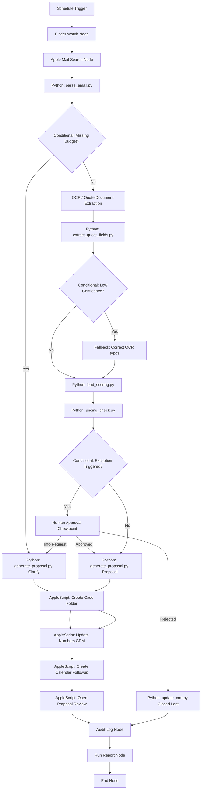

# Orcha Canvas Presentation — OrchaSalesFlow

This document provides a technical map of the **OrchaSalesFlow** workflow implementation onto a visual, node-based Orcha automation canvas. It details how control flows, variables, error fallbacks, and human approval checkpoints are managed.

---

## 1. Workflow Objective
OrchaSalesFlow automates a Mac-native sales operations workflow. It coordinates incoming lead handling, document extraction, business validation, pricing compliance checks, approval routing, proposal generation, local CRM updates, calendar scheduling, and execution logging.

---

## 2. Canvas Overview

---

## 3. Canvas Sections

### Section 1: Trigger and Intake

#### 1. Schedule Trigger Node
* **Node ID:** `schedule_weekday_intake`
* **Node Name:** `Weekday Sales Intake`
* **Node Type:** `ScheduleTrigger`
* **Purpose:** Initiates the workflow run automatically.
* **Input Variables:** None
* **Output Variables:** `trigger_timestamp` (datetime)
* **Success Path:** Triggers `watch_intake_folder`
* **Failure/Fallback Path:** None
* **Retry Policy:** None
* **Human Approval Condition:** None

#### 2. Finder Watch Node
* **Node ID:** `watch_intake_folder`
* **Node Name:** `Lead Intake Folder`
* **Node Type:** `FinderWatchNode`
* **Purpose:** Monitors a specified local directory for new lead text files.
* **Input Variables:** `watch_directory_path` (string)
* **Output Variables:** `new_lead_file_paths` (list)
* **Success Path:** Triggers `search_lead_email`
* **Failure/Fallback Path:** Abort execution, log system warning.
* **Retry Policy:** None
* **Human Approval Condition:** None

#### 3. Apple Mail Search Node
* **Node ID:** `search_lead_email`
* **Node Name:** `Lead Email Search`
* **Node Type:** `AppleScriptNode`
* **Purpose:** Runs a query in Apple Mail to search for previous correspondence from the lead's email address.
* **Input Variables:** `contact_email` (string)
* **Output Variables:** `mail_thread_exists` (boolean), `related_message_ids` (list)
* **Script Used:** `applescript/open_mail_and_search.scpt`
* **Success Path:** Triggers `python_parse_email`
* **Failure/Fallback Path:** Log execution warning, assume no previous correspondence and continue.
* **Retry Policy:** 2 retries (with 5-second backoff)
* **Human Approval Condition:** None

---

### Section 2: Email and Attachment Extraction

#### 4. Python Terminal Node: parse_email.py
* **Node ID:** `python_parse_email`
* **Node Name:** `Parse Lead Email`
* **Node Type:** `PythonTerminalNode`
* **Purpose:** Parses structural fields (contact info, service requirement, budget, urgency) from the email body.
* **Input Variables:** `email_file_path` (string)
* **Output Variables:** `email_data` (JSON)
* **Script Used:** `scripts/parse_email.py`
* **Success Path:** Triggers `conditional_check_budget`
* **Failure/Fallback Path:** Routes to data exception logging.
* **Retry Policy:** None
* **Human Approval Condition:** None

#### 5. OCR / Vision Node
* **Node ID:** `ocr_quote_extraction`
* **Node Name:** `Quote Document Extraction`
* **Node Type:** `OcrVisionNode`
* **Purpose:** Performs text extraction on the attached procurement text file.
* **Input Variables:** `attachment_path` (string)
* **Output Variables:** `raw_ocr_text` (string)
* **Success Path:** Triggers `python_extract_quote_fields`
* **Failure/Fallback Path:** Route to correction fallback.
* **Retry Policy:** 1 automatic retry using enhanced contrast parameters.
* **Human Approval Condition:** None

#### 6. Python Terminal Node: extract_quote_fields.py
* **Node ID:** `python_extract_quote_fields`
* **Node Name:** `Extract Quote Fields`
* **Node Type:** `PythonTerminalNode`
* **Purpose:** Normalizes raw OCR text, resolves spelling substitutions, and extracts budget, discounts, and payment terms.
* **Input Variables:** `raw_ocr_text` (string)
* **Output Variables:** `quote_data` (JSON), `ocr_confidence` (double)
* **Script Used:** `scripts/extract_quote_fields.py`
* **Success Path:** Triggers `conditional_check_ocr_confidence`
* **Failure/Fallback Path:** Routes to manual exception checkpoint.
* **Retry Policy:** None
* **Human Approval Condition:** None

---

### Section 3: AI Reasoning and Lead Qualification

#### 7. AI Reasoning Node
* **Node ID:** `ai_lead_summary`
* **Node Name:** `Lead Summary and Classification`
* **Node Type:** `AiReasoningNode`
* **Purpose:** Synthesizes unstructured request text and determines lead segment (Enterprise vs SMB).
* **Input Variables:** `raw_email_body` (string)
* **Output Variables:** `is_enterprise` (boolean), `strategic_summary` (string)
* **Success Path:** Passes variables to scoring block.
* **Failure/Fallback Path:** Default to standard classification logic.
* **Retry Policy:** None
* **Human Approval Condition:** None

#### 8. Python Terminal Node: lead_scoring.py
* **Node ID:** `python_lead_scoring`
* **Node Name:** `Lead Scoring Grader`
* **Node Type:** `PythonTerminalNode`
* **Purpose:** Computes a numerical rating out of 100 based on lead criteria.
* **Input Variables:** `email_data` (JSON), `quote_data` (JSON)
* **Output Variables:** `score_data` (JSON: score, stage, segment, next_action)
* **Script Used:** `scripts/lead_scoring.py`
* **Success Path:** Triggers `python_pricing_check`
* **Failure/Fallback Path:** Halt execution for that specific record, log audit event.
* **Retry Policy:** None
* **Human Approval Condition:** None

#### 9. Conditional Node: Score Threshold
* **Node ID:** `conditional_score_threshold`
* **Node Name:** `Score Threshold Classifier`
* **Node Type:** `ConditionalNode`
* **Purpose:** Directs downstream actions based on the numerical score (e.g. Hot Lead vs Nurture).
* **Input Variables:** `score_data.score`
* **Output Variables:** `routing_branch` (string)
* **Success Path:**
  * Score >= 60: Proceed with pipeline
  * Score < 40: Route directly to Nurture CRM stage

---

### Section 4: Pricing and Policy Control

#### 10. Python Terminal Node: pricing_check.py
* **Node ID:** `python_pricing_check`
* **Node Name:** `Pricing Exception Checker`
* **Node Type:** `PythonTerminalNode`
* **Purpose:** Enforces financial rules by comparing lead parameters against standard service limits.
* **Input Variables:** `email_data` (JSON), `quote_data` (JSON)
* **Output Variables:** `pricing_data` (JSON: approval_required, reasons, deal_value)
* **Script Used:** `scripts/pricing_check.py`
* **Success Path:** Triggers `conditional_check_pricing_approval`
* **Failure/Fallback Path:** Log warning, flag approval required.
* **Retry Policy:** None
* **Human Approval Condition:** None

#### 11. Conditional Node: Pricing Exception
* **Node ID:** `conditional_check_pricing_approval`
* **Node Name:** `Pricing Exception Gate`
* **Node Type:** `ConditionalNode`
* **Purpose:** Branches the execution path depending on compliance rules.
* **Input Variables:** `pricing_data.approval_required`
* **Output Variables:** `branch` (string)
* **Success Path:**
  * If `true`: Routes to `human_approval_checkpoint`
  * If `false`: Routes to `python_generate_proposal`

#### 12. Conditional Node: Missing Budget
* **Node ID:** `conditional_check_budget`
* **Node Name:** `Missing Budget Classifier`
* **Node Type:** `ConditionalNode`
* **Purpose:** Detects if budget data was omitted from the intake form.
* **Input Variables:** `email_data.budget`
* **Output Variables:** `branch` (string)
* **Success Path:**
  * If present: Routes to `ocr_quote_extraction`
  * If missing: Routes to `python_generate_clarification`

---

### Section 5: Human Approval

#### 13. Human Approval Node
* **Node ID:** `human_approval_checkpoint`
* **Node Name:** `Pricing Exception Review`
* **Node Type:** `HumanApprovalCheckpoint`
* **Purpose:** Suspends execution, creates a review report on disk, and waits for a manager's decision file.
* **Input Variables:** `approval_request_path` (string)
* **Output Variables:** `manager_decision` (string)
* **Script/Action Used:** Monitored via CLI prompt or visual dashboard entry
* **Success Path:** Triggers `conditional_check_manager_decision`
* **Failure/Fallback Path:** None (suspends execution until user resolution)
* **Retry Policy:** None
* **Human Approval Condition:** Triggered on discount > 15%, budget below catalog minimum, or non-standard payment terms.

#### 14. Approval Decision Reader
* **Node ID:** `approval_decision_reader`
* **Node Name:** `Read Decision File`
* **Node Type:** `FileWatcherNode`
* **Purpose:** Scans the folder for the presence of the `approval_decision.txt` file.
* **Input Variables:** `decision_file_path` (string)
* **Output Variables:** `decision_content` (string)
* **Success Path:** Resolves the checkpoint.
* **Failure/Fallback Path:** Keep execution suspended.

#### 15. Approval Outcome Router
* **Node ID:** `conditional_check_manager_decision`
* **Node Name:** `Approval Decision Gate`
* **Node Type:** `ConditionalNode`
* **Purpose:** Routes downstream execution based on manager sign-off.
* **Input Variables:** `manager_decision`
* **Success Path:**
  * `APPROVE`: Route to `python_generate_proposal`
  * `REJECT`: Route to `python_update_crm_disqualified`
  * `REQUEST_MORE_INFO`: Route to `python_generate_clarification`

---

### Section 6: Proposal and Clarification Generation

#### 16. Proposal Generation Node
* **Node ID:** `python_generate_proposal`
* **Node Name:** `Compile Sales Proposal`
* **Node Type:** `PythonTerminalNode`
* **Purpose:** Combines the proposal template with resolved pricing data to compile a formal client proposal.
* **Input Variables:** `email_data`, `pricing_data`
* **Output Variables:** `proposal_path` (string)
* **Script Used:** `scripts/generate_proposal.py`
* **Success Path:** Triggers `applescript_create_case_folder`
* **Failure/Fallback Path:** Log audit failure, halt lead path.
* **Retry Policy:** 1 retry.

#### 17. Clarification Request Node
* **Node ID:** `python_generate_clarification`
* **Node Name:** `Compile Clarification Letter`
* **Node Type:** `PythonTerminalNode`
* **Purpose:** Generates a structured query email to request missing budget parameters.
* **Input Variables:** `email_data`
* **Output Variables:** `proposal_path` (string)
* **Script Used:** `scripts/generate_proposal.py`
* **Success Path:** Triggers `applescript_create_case_folder`
* **Failure/Fallback Path:** Log failure.
* **Retry Policy:** None.

#### 18. AppleScript Node: Open Proposal for Review
* **Node ID:** `applescript_open_proposal`
* **Node Name:** `Open Proposal Review`
* **Node Type:** `AppleScriptNode`
* **Purpose:** Launches the native text editor to display the compiled proposal to the account manager.
* **Input Variables:** `proposal_path` (string)
* **Script Used:** `applescript/open_proposal_for_review.scpt`
* **Success Path:** Triggers `write_audit_log`
* **Failure/Fallback Path:** Log warning, skip open step, continue to logging.
* **Retry Policy:** None.

---

### Section 7: Mac-Native App Automation

#### 19. AppleScript Node: Create Finder Case Folder
* **Node ID:** `applescript_create_case_folder`
* **Node Name:** `Create Finder Case Folder`
* **Node Type:** `AppleScriptNode`
* **Purpose:** Automates Finder to create hierarchical client folders (`/Proposals`, `/Communications`, `/SourceData`) under `~/Documents/`.
* **Input Variables:** `lead_id` (string), `company_name` (string)
* **Output Variables:** `case_folder_path` (string)
* **Script Used:** `applescript/create_finder_case_folder.scpt`
* **Success Path:** Triggers `applescript_update_crm_numbers`
* **Failure/Fallback Path:** Create folders inside Python runner (fallback directory builder).
* **Retry Policy:** 1 retry.

#### 20. AppleScript Node: Update Numbers CRM
* **Node ID:** `applescript_update_crm_numbers`
* **Node Name:** `Update Numbers CRM`
* **Node Type:** `AppleScriptNode`
* **Purpose:** Opens Apple Numbers to insert or update cells tracking the pipeline row data.
* **Input Variables:** `lead_id`, `company_name`, `deal_value`, `pipeline_stage`, `payment_terms`
* **Script Used:** `applescript/update_numbers_crm.scpt`
* **Success Path:** Triggers `applescript_create_calendar_followup`
* **Failure/Fallback Path:** Log warning, fallback to python CSV update.
* **Retry Policy:** 2 retries.

#### 21. AppleScript Node: Create Calendar Follow-up
* **Node ID:** `applescript_create_calendar_followup`
* **Node Name:** `Create Calendar Followup`
* **Node Type:** `AppleScriptNode`
* **Purpose:** Interacts with Apple Calendar to schedule follow-up appointments.
* **Input Variables:** `company_name` (string), `followup_date` (string), `next_action` (string)
* **Script Used:** `applescript/create_calendar_followup.scpt`
* **Success Path:** Triggers `applescript_open_proposal`
* **Failure/Fallback Path:** Write warning to audit log, continue.
* **Retry Policy:** 1 retry.

---

### Section 8: CRM, Audit Logging, and Run Report

#### 22. Python Terminal Node: update_crm.py
* **Node ID:** `python_update_crm`
* **Node Name:** `Update Local CRM Database`
* **Node Type:** `PythonTerminalNode`
* **Purpose:** Logs records into the spreadsheet sales tracker in an idempotent manner.
* **Input Variables:** `lead_data`, `score_data`, `pricing_data`, `proposal_path`
* **Output Variables:** `crm_status`
* **Script Used:** `scripts/update_crm.py`
* **Success Path:** Handled sequentially during runs.

#### 23. Audit Log Node
* **Node ID:** `write_audit_log`
* **Node Name:** `Write Audit Log`
* **Node Type:** `AuditLogNode`
* **Purpose:** Logs structured JSONL lines detailing timestamps, run variables, retries, and errors.
* **Input Variables:** Pipeline states
* **Script Used:** `scripts/audit_logger.py`
* **Success Path:** Routes to report compiler.

#### 24. Run Report Node
* **Node ID:** `generate_run_report`
* **Node Name:** `Compile Run Report`
* **Node Type:** `ReportCompilerNode`
* **Purpose:** Compiles overall pipeline results into a summary markdown report.
* **Success Path:** Triggers end node.

#### 25. End Node
* **Node ID:** `node_end`
* **Node Name:** `End Node`
* **Node Type:** `EndNode`
* **Purpose:** Gracefully terminates the execution cycle.

---

## 4. Why This Fits Orcha

* **Local-First Execution**: The automation runs directly on macOS hardware. Sensitive financial proposals and client data are never sent to third-party cloud servers.
* **Native Mac Application Automation**: Leverages AppleScript wraps to interact with Finder, Mail, Numbers, and Calendar, illustrating desktop control capabilities.
* **No External API Key Dependency**: Runs completely offline, utilizing deterministic rules, regex, and local templates, making it safe for clients with strict security constraints.
* **Node-Based Control Flow**: Adapts naturally to Orcha's visual architecture, implementing schedule triggers, folders watch gates, conditional routers, retries, and manual checkpoints.
* **Auditability and Traceability**: Emits a detailed compliance trail to JSONL logs, satisfying strict operations controls (such as SOC2 or GDPR).

---

## 5. Best Walkthrough Path

To present this implementation in a meeting, focus on **LEAD-004 (Horizon Logistics)**:
1. **Intake**: Explain how the email parser extracts the customer details and requirement.
2. **Extraction**: Show the quote attachment parsing.
3. **Scoring**: Highlight the calculated qualification score.
4. **Policy Enforcement**: Explain the pricing checker flagging standard policy violations (25% discount requested vs 15% max standard discount, Net 90 payment terms requested vs Net 30 standard terms).
5. **Approval checkpoint**: Show the execution pausing, opening the generated markdown risk report in the approvals folder, and manually resolving the checkpoint.
6. **Downstream Automation**: Showcase proposal creation (watermarked with the special exception code), Finder case folder initialization, Apple Numbers updates, Apple Calendar event scheduling, and the final audit log entry.
